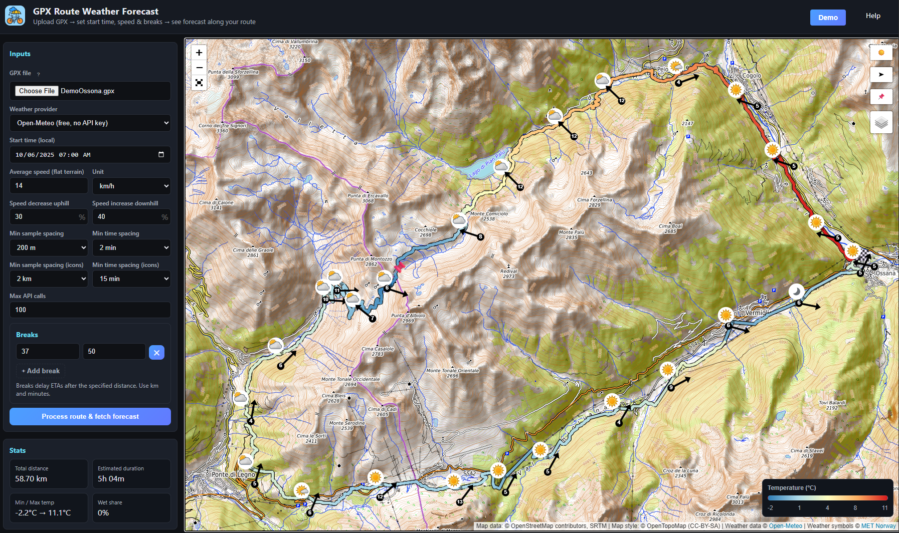
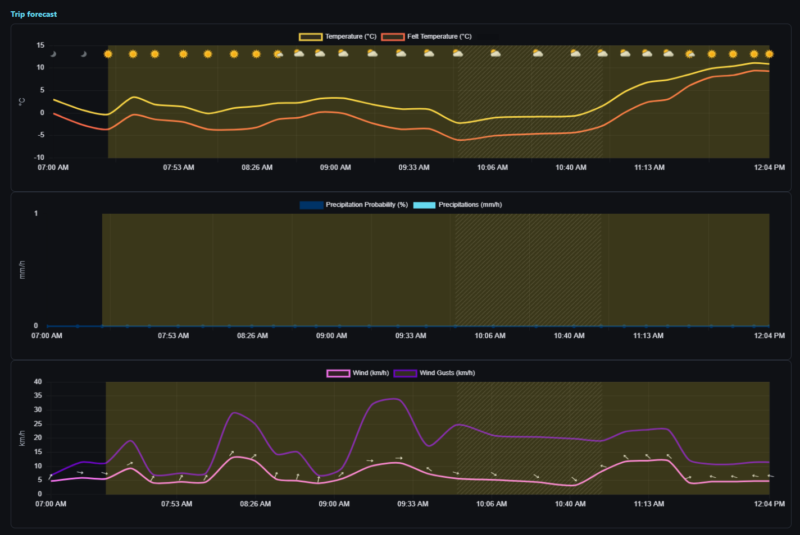
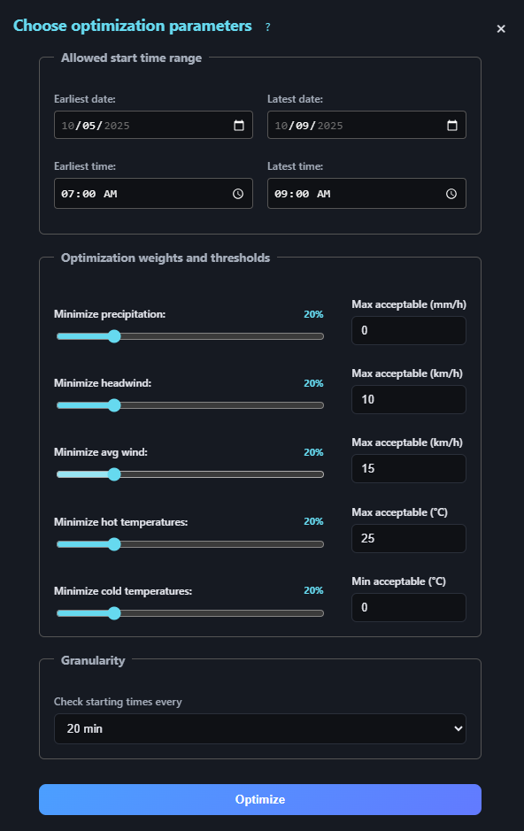
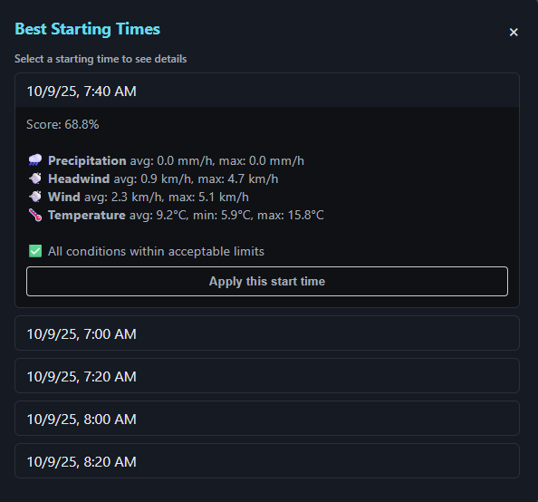

# Cycle Weather
See weather forecast along a cycling route (.gpx file) and find the optimal start time.

## Description
Cycle Weather is a simple app that allows you to visualize the weather forecast along a cycling route defined in a GPX file and find the optimal start time for your ride given some optimization parameters.

Given a starting timestamp and an average speed, the app uses one of Open-Meteo API or MeteoBlue API to fetch weather data and displays it on a map.

In order to use the MeteoBlue API, you need to create an account and obtain an API key which you will need to paste in the apposite field in the app.
Register on the [MeteoBlue website](https://www.meteoblue.com/en/weather-api), confirm your email address, and find your key in the [API Key Management](https://www.meteoblue.com/en/weather-api/apikey/index) section of your account.

You can choose between three maps:
* OpenCycleMap
* OpenTopoMap
* OpenStreetMap

The app also allows you to insert breaks along the route, which will be displayed on the map as a pin and on the charts as a grey shaded area. To insert a new break, you can either insert the km at which the break will start; or click on the map to select the position of the break. Then, insert the break's length in number of minutes.

At the bottom of the page, three graphs show, respectively, (i) the actual and the felt temperature, (ii) precipitations, and (iii) the wind speed, gusts and direction for the route. The yellow shade indicates daylight hours.

To find the optimal starting time for your route, click on the checkbox "Optimize start time" below the map. This will open a window as the following:

Here you can choose the time window in which to search for the optimal starting time, the optimization criteria along with weights and maximum acceptable thresholds for each; and the granularity of the search (i.e., how many different starting times to evaluate within the time window).
The app will return the five best starting times according to the criteria specified, each with a score and a summary of the weather conditions along the route.

You can click on "Apply this start time" to update the map and charts with the selected starting time.

